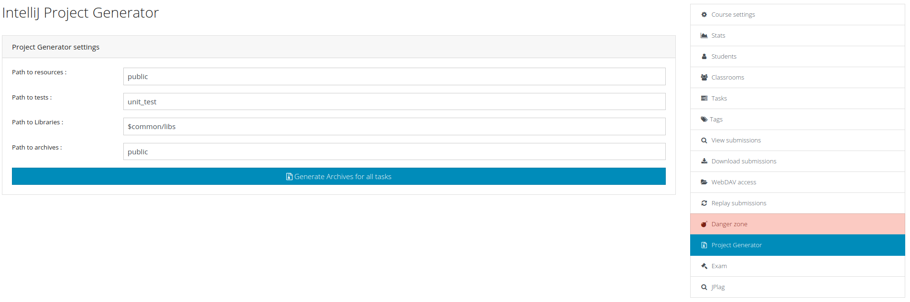
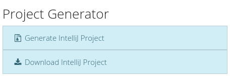
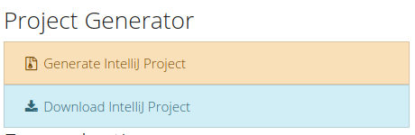
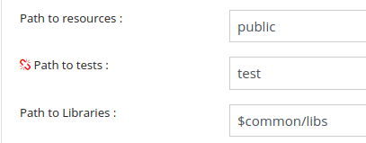

# IntelliJProjectGenerator
A plugin for [INGInious](https://inginious.info.ucl.ac.be/) that allow to generate archives of [IntelliJ](https://www.jetbrains.com/idea/) projects for a particular  task or for all tasks. 
It also allows student to download these archive via a button.

## Installation
Install the plugin via pip:

`pip install git+https://github.com/UCL-INGI/INGInious-IntelliJProjectGenerator.git`

Then add the plugin in your configuration.yaml

``` yaml
plugins:
- plugin_module: inginious_project_generator
```

## Configuration
To generate an archive, the plugin needs to know the different paths to the directories where the files needed for the project are located.

4 paths are needed : 

- The path inside the **task** directory, that contains the java classes that must be implemented by students
- The path inside the **task** directory, that contains the tests that the students can have
- The path inside the **course** directory, where the different libraries needed are located
- The path inside the **task** directory, where the archive will be generated

You can configure these paths in the following page :



To access this page you just need to go to your administration interface and click on *Project Generator* in the right column.

The configuration is saved inside the file `project_generator_config.yaml` located at root of the course directory.

The structure of the course corresponding to the default configuration of the plugin looks like this one (corresponding to the image above) :
```bash
course_id
├── $common
│   └── libs
│       └── library-version.jar
├── project_generator_config.yaml
└── task_id
    ├── public
    │   └── ClassToImplement.java
    └── unit_test
        └── Test.java


```

And here is an example from [LEPL1402](https://github.com/UCL-INGI/LEPL1402) of the structure based on the default configuration.

```bash
LEPL1402
├── CircularLinkedList
│   ├── public
│   │   ├── CircularLinkedList.java
│   │   ├── LEPL1402_CircularLinkedList.zip
│   │   └── Selection_013.png
│   └── unit_test
├── project_generator_config.yaml
│       ├── CircularLinkedListTestComplexity.java
│       ├── CircularLinkedListTestExtreme.java
│       └── CircularLinkedListTestRandom.java
└── $common
    └── libs
        ├── hamcrest-core-1.3.jar
        ├── jacocoagent.jar
        ├── jacococli.jar
        ├── JavaGrading.jar
        └── junit-4.12.jar

```

## Usage

You can generate an archive in two different ways.

### Generate one archive for each task

With the page seen above, you can generate an archive for each tasks inside the course that respect the structure you've defined.

An archive is generated for a task only if it contains java classes to implement.

### Generate one archive for one specific task

When you are on the page of a task, two buttons appears in the right column :



The first one permits you to go to the configuration page and the second to generate and download directly the archive correspond to this task.

The first one is only accessible for administrators of the course and the second one is accessible of everyone.

The button *Generate IntelliJ Project* can become orange in certain tasks. It means that one of the path in the configuration is wrong.
You can generate the archive for these tasks but it will miss the elements corresponding to the wrong path.

 

When a path is wrong, a little red icons will appear in front of this wrong path.



### Generate an archive without tests or libraries

You can generate an archive without tests or libraries. The IntelliJ project will be correctly generate but simply without the missing elements.

## Note

**Note also that these two buttons are only accessible if the task contains java classes to implement.**